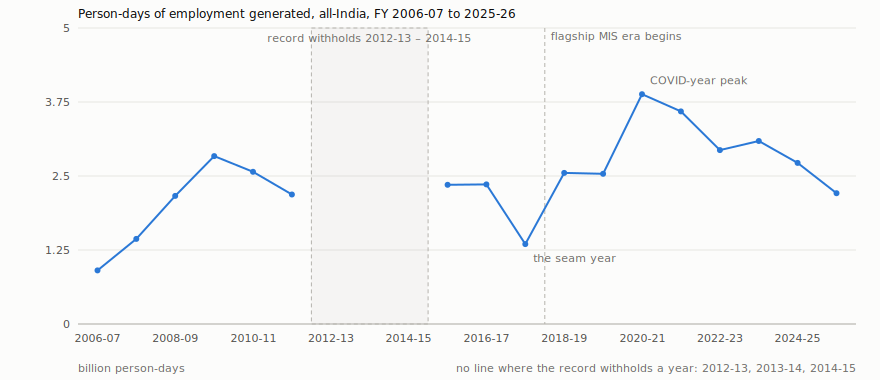
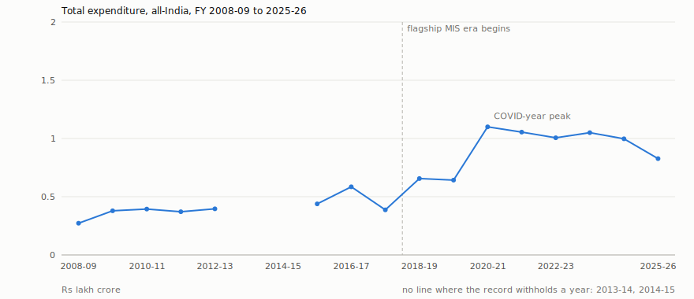
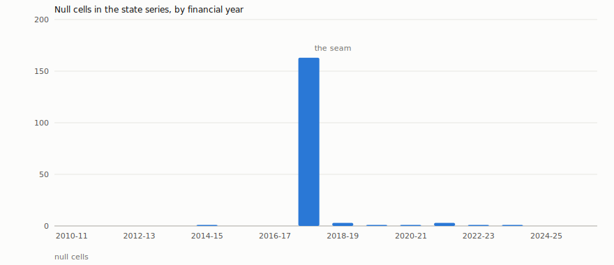
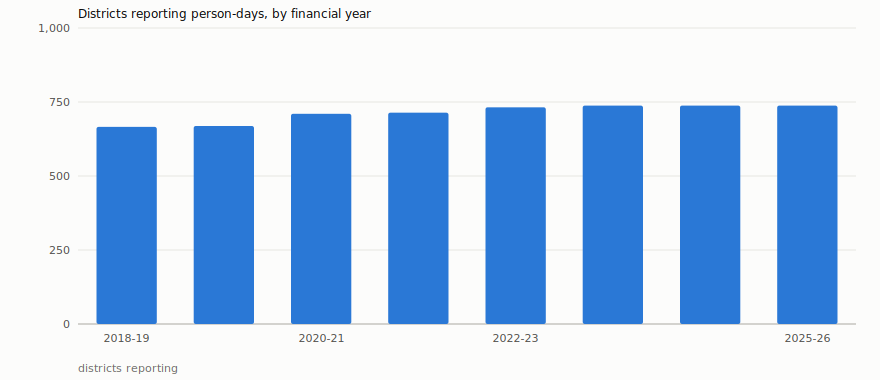

# MGNREGA, 2006-2026: what the record says

*Generated 2026-07-14T08:05:07+00:00 from the MGNREGA canonical series v1.0.0 (DOI [10.5281/zenodo.21318431](https://doi.org/10.5281/zenodo.21318431)), served read-only over MCP.*

> **Every number in this document was machine-verified against the served dataset.** The prose was written by a language model that could see the record only through the query server, and that never chose a number: each figure it was given was re-checked against the data after drafting, each derived figure was recomputed from its inputs, and a section whose numbers failed to check was blocked from the report. The tables beneath each section are the evidence — every figure with its `fact_id` and its sources.

## Abstract

This document constitutes a reconciled, lineage-traced record of MGNREGA, India's rural employment guarantee scheme in force from 2006 until its repeal effective 30 June 2026, assembled from separately published government datasets on data.gov.in into one canonical annual series and read by an analyst solely through a governed query interface. At its peak in FY 2020-21, the scheme delivered 3.88 billion person-days of employment, a level corresponding to 4.29 times the activity of its first year, FY 2006-07. Among state-year cells, publishers materially disagree in 34 instances, and the record withholds 164 cells as partial-period-only instead of supplying estimates. Every numeric value in this account was machine-verified against the served data, and any figure that could not be verified was blocked from printing rather than conjectured.

| figure | value | unit | period | fact_id | sources |
|---|---|---|---|---|---|
| person-days generated at the scheme's peak, FY 2020-21 | 3881318918 | person-days | 2020-21 | `5dbb027fdfca056a` | SRC_FLAGSHIP (ee03643a-ee4c-48c2-ac30-9f2ff26ab722, as of 2026-06-29T17:00:24+00:00) |
| person-days generated in the first year, FY 2006-07 | 905054000 | person-days | 2006-07 | `7a994fb98ad65b7c` | SRC_MOSPI (04476f1d-c61c-4584-9e0a-b1cb62410f5f, as of 2018-11-30T04:47:52+00:00); SRC_MOSPI (1878204d-9048-4016-8e56-a2fe2cf4fe97, as of None); SRC_MOSPI (54d1a5fa-7663-4c10-84ce-c184c7761fcc, as of None); SRC_MOSPI (d88e2cb6-842b-48ed-884c-a561c8f113ff, as of None) |

| count | value | selected by (the complete predicate) | members |
|---|---|---|---|
| state-year cells where publishers materially disagree | 34 | `table = state_annual_series AND confidence == flagged-disagreement` | 34 fact ids in report.json |
| state-year cells the record withholds as partial-period-only | 164 | `table = state_annual_series AND confidence == partial-period-only` | 164 fact ids in report.json |

| derived figure | operation | inputs | value |
|---|---|---|---|
| peak-year person-days, in billions | to_billions | `5dbb027fdfca056a` | 3.88 |
| peak-year person-days as a multiple of the first year's | ratio_2dp | `5dbb027fdfca056a`, `7a994fb98ad65b7c` | 4.29 |

## Introduction

The Mahatma Gandhi National Rural Employment Guarantee Act, enacted in 2005, constituted India's rural employment guarantee and operated from financial year 2006-07 by granting rural households a legal right to a fixed annual quota of paid manual labour, with the state bound to supply that work on demand. Work performed under the scheme was tallied in person-days, defined as one day of labour by one person, while expenditure was recorded in rupees and participation in terms of households employed. The scheme was repealed with effect from 30 June 2026, rendering its documentary record closed so that no new statistics will be published for it. In the last complete financial year of 2025-26, it generated 2.21 billion person-days of employment.

This document is a reading of a reconciled dataset built from the multiple government datasets separately published on India's open-data portal, sources that diverge from one another on units, geographic boundaries, and even on the numerical values themselves. It is not an evaluation of the scheme's policy merits and it draws no causal conclusions, limiting itself to stating what the record contains, the confidence attached to those contents, and the points at which it declines to answer. The operational span of the record runs from 2006-07 through 2026-27, with 2025-26 as the final complete financial year and the partial concluding year represented only by the month of April 2026. No information about any programme that may have followed the repeal appears here, as the served data contains no such fact.

The record declines to answer for any period beyond the scheme's termination. The served reason for the absence of data from 2027-28 onward is "No data on or after 2027-28: MGNREGA was repealed effective 30 June 2026, so the canonical series ends at FY 2026-27 and this is a closed historical record." No successor programme is described, because the dataset holds no such fact.

| figure | value | unit | period | fact_id | sources |
|---|---|---|---|---|---|
| national person-days generated in the last complete year, FY 2025-26 | 2209959751 | person-days | 2025-26 | `83c83d273e27ab9a` | SRC_FLAGSHIP (ee03643a-ee4c-48c2-ac30-9f2ff26ab722, as of 2026-06-29T17:00:24+00:00) |

| derived figure | operation | inputs | value |
|---|---|---|---|
| last complete year's person-days, in billions | to_billions | `83c83d273e27ab9a` | 2.21 |

> **The record refuses:** `query(table="national_annual_series", fy_from="2027-28")`
> → `record_sealed` — No data on or after 2027-28: MGNREGA was repealed effective 30 June 2026, so the canonical series ends at FY 2026-27 and this is a closed historical record.

## Methodology

From fiscal year 2018-19 onward, the figures for the scheme come from the government's own district-level management information system, the primary production authority for the period it covers. Before that, the flagship system published nothing, so the years back to 2006-07 are carried by archived secondary sources, specifically statistical yearbooks and tables tabled in Parliament in answer to questions. The pre-2018 archived sources supply 76 national facts, while the district management information system supplies 72 national facts. The join between these two eras is a seam, and the report does not pretend otherwise.

When two publishers of comparable standing disagree on the same cell, the record applies a documented rule and keeps the rejected value, its publisher, and the size of the gap in the lineage, so the disagreement is published rather than hidden. Where the primary district management information system disagrees with a figure tabled in Parliament for the same cell, the primary system stands and the divergence is recorded as a flagged note rather than adjudicated between peers. A disagreement is counted only if it clears a two-part materiality floor: it must be large in absolute terms and large relative to the value, ensuring that rounding noise is never reported as a conflict.

Where the compilation cannot honestly assert a value—because the only available reading covers part of a year, or an incomplete aggregate contradicts a complete one—the cell is left empty and carries the reason why, and an empty cell is never written as a zero. The record declined to provide state annual series for the entry "2019", stating: "Malformed financial year '2019'. Expected exactly 'YYYY-YY', where the two-digit suffix is the start year plus one — e.g. '2018-19' for the year running April 2018 to March 2019."

The prose in this document was written by a language model, but the model never chose a number. Each figure was retrieved from the query server by code, with its provenance attached; figures the report combines, such as sums, ratios, and unit conversions, were computed by code and recomputed independently afterwards; and every number in the finished prose was checked back against the served data. A number that failed the check blocked its section from the report entirely. The model cannot query the data and cannot do arithmetic—it can only narrate what it was handed.

| count | value | selected by (the complete predicate) | members |
|---|---|---|---|
| national facts carried by the pre-2018 archived sources | 76 | `table = national_annual_series AND era_basis == historical` | 76 fact ids in report.json |
| national facts carried by the district management information system | 72 | `table = national_annual_series AND era_basis == flagship-rollup` | 72 fact ids in report.json |

> **The record refuses:** `query(table="state_annual_series", fy_from="2019")`
> → `invalid_period` — Malformed financial year '2019'. Expected exactly 'YYYY-YY', where the two-digit suffix is the start year plus one — e.g. '2018-19' for the year running April 2018 to March 2019.

## The twenty-year record, 2006-07 to 2026-27

MGNREGA's national record opened in 2006-07 with 0.91 billion person-days generated across India. The scheme's peak year was 2020-21, when 3.88 billion person-days were generated, a volume 4.29 times that of the inaugural year. In that peak financial year, total expenditure stood at 1.1 lakh crore rupees and 75.5 million households were employed.

The final complete financial year before repeal was 2025-26, with 2.21 billion person-days generated. The series extends to a partial stub for 2026-27 covering April 2026 only, which recorded 12.91 million person-days; because the scheme was repealed effective 30 June 2026, this figure is not comparable to a full year and the canonical series closes with FY 2026-27 as a stub.

The national annual series is stitched from two distinct sourcing eras. A count of 76 national facts derives from the pre-2018 archive, drawing on archived publishers such as MoSPI and Rajya Sabha answers, while 72 national facts from FY 2018-19 onward are sourced from the flagship district MIS.

The record contains no data for financial years from 2027-28 onward. It states plainly: "No data on or after 2027-28: MGNREGA was repealed effective 30 June 2026, so the canonical series ends at FY 2026-27 and this is a closed historical record."



*Every point is a verified fact in the canonical series; a year the record withholds is drawn as no point, never as zero, and the line breaks there. FY 2026-27 is omitted: the scheme was repealed effective 30 June 2026, so that year holds April 2026 alone and a single month cannot be plotted against full years. Its figures are reported in the text and the tables. Plotted from 17 verified figures; the figure ids are listed in `report.json` under `charts`.*



*Expenditure in lakh crore rupees, reconciled across publishers. The pre-2018 points come from archived MoSPI and Rajya Sabha sources; from FY 2018-19 the flagship district MIS is the production authority. FY 2026-27 is omitted: the scheme was repealed effective 30 June 2026, so that year holds April 2026 alone and a single month cannot be plotted against full years. Its figures are reported in the text and the tables. Plotted from 16 verified figures; the figure ids are listed in `report.json` under `charts`.*

| figure | value | unit | period | fact_id | sources |
|---|---|---|---|---|---|
| national person-days generated, FY 2006-07 (the first year) | 905054000 | person-days | 2006-07 | `7a994fb98ad65b7c` | SRC_MOSPI (04476f1d-c61c-4584-9e0a-b1cb62410f5f, as of 2018-11-30T04:47:52+00:00); SRC_MOSPI (1878204d-9048-4016-8e56-a2fe2cf4fe97, as of None); SRC_MOSPI (54d1a5fa-7663-4c10-84ce-c184c7761fcc, as of None); SRC_MOSPI (d88e2cb6-842b-48ed-884c-a561c8f113ff, as of None) |
| national person-days generated, FY 2020-21 (the peak year) | 3881318918 | person-days | 2020-21 | `5dbb027fdfca056a` | SRC_FLAGSHIP (ee03643a-ee4c-48c2-ac30-9f2ff26ab722, as of 2026-06-29T17:00:24+00:00) |
| national person-days generated, FY 2025-26 (the last complete year) | 2209959751 | person-days | 2025-26 | `83c83d273e27ab9a` | SRC_FLAGSHIP (ee03643a-ee4c-48c2-ac30-9f2ff26ab722, as of 2026-06-29T17:00:24+00:00) |
| national person-days generated, FY 2026-27 (April 2026 only — a repeal stub) | 12914539 | person-days | 2026-27 | `8091ebe4d569f7bc` | SRC_FLAGSHIP (ee03643a-ee4c-48c2-ac30-9f2ff26ab722, as of 2026-06-29T17:00:24+00:00) |
| national total expenditure, FY 2020-21 | 10999798.601773694 | INR lakh | 2020-21 | `1283dfe2b4694161` | SRC_FLAGSHIP (ee03643a-ee4c-48c2-ac30-9f2ff26ab722, as of 2026-06-29T17:00:24+00:00) |
| national households employed, FY 2020-21 | 75500579 | count | 2020-21 | `4da0d36e5d5d1ff1` | SRC_FLAGSHIP (ee03643a-ee4c-48c2-ac30-9f2ff26ab722, as of 2026-06-29T17:00:24+00:00) |

| count | value | selected by (the complete predicate) | members |
|---|---|---|---|
| national facts sourced from the pre-2018 archive (historical era) | 76 | `table = national_annual_series AND era_basis == historical` | 76 fact ids in report.json |
| national facts sourced from the flagship district MIS (FY 2018-19 onward) | 72 | `table = national_annual_series AND era_basis == flagship-rollup` | 72 fact ids in report.json |

| derived figure | operation | inputs | value |
|---|---|---|---|
| peak-year person-days divided by first-year person-days (2 decimal places) | ratio_2dp | `5dbb027fdfca056a`, `7a994fb98ad65b7c` | 4.29 |
| first-year person-days, in billions | to_billions | `7a994fb98ad65b7c` | 0.91 |
| peak-year person-days, in billions | to_billions | `5dbb027fdfca056a` | 3.88 |
| last complete year's person-days, in billions | to_billions | `83c83d273e27ab9a` | 2.21 |
| the repeal stub's person-days, in millions | to_millions | `8091ebe4d569f7bc` | 12.91 |
| peak-year total expenditure, in lakh crore rupees | lakh_to_lakh_crore | `1283dfe2b4694161` | 1.1 |
| peak-year households employed, in millions | to_millions | `4da0d36e5d5d1ff1` | 75.5 |

> **The record refuses:** `query(table="national_annual_series", fy_from="2027-28")`
> → `record_sealed` — No data on or after 2027-28: MGNREGA was repealed effective 30 June 2026, so the canonical series ends at FY 2026-27 and this is a closed historical record.

## Where the publishers disagree, and what the record does about it

The record separates pre-2018 cross-publisher material disagreements from flagship-era divergences between the primary district MIS and Parliament-tabled figures, and neither set is merged into a single count. Both sets passed the same two-part materiality floor, under which a disagreement is recognised only when it clears an absolute threshold and a relative threshold. The pre-2018 set comprises 9 state-year cells where MoSPI and Rajya Sabha parliamentary answers disagreed and a canonical value was adjudicated between the two sources of comparable standing. The flagship-era set comprises 25 state-year cells from FY 2018-19 onward where the primary district MIS and figures tabled in Parliament diverged, with the production authority's figure recorded as a flagged note rather than adjudicated between peers. Together these flagged cells number 34.

One such case is Telangana in FY 2016-17, where the record publishes a canonical total expenditure of 2,108.98 crore rupees, drawn from the Rajya Sabha figure after adjudication between the two archived publishers. This amount is the value the record settled on for that state-year cell, not the size of the gap between the publishers; the rejected MoSPI estimate is retained in lineage.

One such case is Lakshadweep in FY 2023-24, where the primary district MIS reported 3,510 person-days and that figure becomes the canonical value recorded as a flagged note. This count is the value the record publishes for the cell, not the size of the gap between the publishers; the Parliament-tabled figure stays in lineage. The authority rule assigns the production authority's figure as the published value while keeping the parliamentary figure visible rather than discarding it.

The separation of these two phenomena and the retention of rejected values in lineage mean the record exposes its disagreements instead of smoothing them away. In the pre-2018 set the reconciliation adjudicated between peers, whereas in the flagship-era set the divergence is noted under an authority hierarchy, but in both the underlying conflict remains inspectable. This approach constitutes a governance choice to show friction rather than hide it.

| figure | value | unit | period | fact_id | sources |
|---|---|---|---|---|---|
| Telangana total expenditure, FY 2016-17 — one pre-2018 case: this is the CANONICAL VALUE the record publishes (the Rajya Sabha figure), not the size of the gap; MoSPI's rejected value is kept in lineage | 210898.07 | INR lakh | 2016-17 | `744999f0f06a48a9` | SRC_MOSPI (d64434e9-fc81-4834-954b-5e494e0ee2c7, as of None); SRC_RS (57bff16a-6423-45b2-9700-ebcde6709937, as of 2021-03-23T11:28:45+00:00) |
| Lakshadweep person-days, FY 2023-24 — one flagship-era case: this is the CANONICAL VALUE the record publishes (the district MIS figure), not the size of the gap; the Parliament-tabled figure is kept in lineage | 3510 | person-days | 2023-24 | `cfa86a20e8b191f3` | SRC_FLAGSHIP (ee03643a-ee4c-48c2-ac30-9f2ff26ab722, as of 2026-06-29T17:00:24+00:00); SRC_RS (cea6ee41-2b18-4266-b42b-0af54c13b18c, as of 2025-03-07T05:53:39+00:00); SRC_RS (e289a8fe-3fd4-4964-9579-5bddb88e36b8, as of 2024-11-02T17:56:25+00:00) |

| count | value | selected by (the complete predicate) | members |
|---|---|---|---|
| pre-2018 cross-publisher material disagreements, ADJUDICATED between MoSPI and Rajya Sabha (state series) | 9 | `table = state_annual_series AND fy <= 2017-18 AND confidence == flagged-disagreement` | 9 fact ids in report.json |
| flagship-era divergences between the primary district MIS and figures tabled in Parliament, RECORDED as flagged notes (state series, FY 2018-19 onward) | 25 | `table = state_annual_series AND fy >= 2018-19 AND confidence == flagged-disagreement` | 25 fact ids in report.json |

| derived figure | operation | inputs | value |
|---|---|---|---|
| flagged cells in the record (the two sets added together) | sum | `pre_2018_disagreements`, `flagship_era_divergences` (34 facts; enumerated in report.json) | 34 |
| Telangana's canonical FY 2016-17 total expenditure, in crore rupees | lakh_to_crore | `744999f0f06a48a9` | 2108.98 |

## Goa, FY 2022-23: the spine reconciles, and the rate refuses to

In FY 2022-23, the Goa state series for MGNREGA records 94,004 person-days generated. North Goa accounted for 42,253 person-days and South Goa for 51,751 person-days within the same period. The addition of the two district totals aligns exactly with the state figure, and the difference between the state value and the district sum is 0 person-days.

The average wage rate per day is served only at district-annual grain, with North Goa at 383.78 rupees per day and South Goa at 330.93 rupees per day for that year. These rates are not additive quantities, so summing the district values would produce no meaningful result. The state series does not provide this rate; the recorded reason is "Metric 'avg_wage_rate_per_day' is not available at this grain; it lives in district_flagship. Call get_schema for a table's metrics."

The record is annual-only. When asked for a monthly figure, it states: "The series is annual-grain only; monthly figures are not served. In particular, monthly avg_wage_rate_per_day values are cumulative year-to-date ratios, not valid monthly rates — the wage rate is published only as the financial-year-final annual value at district-annual grain. Remove 'month' to query the annual series." No monthly or state-level wage rate appears in the dataset for Goa in FY 2022-23.

| figure | value | unit | period | fact_id | sources |
|---|---|---|---|---|---|
| North Goa person-days generated, FY 2022-23 | 42253 | person-days | 2022-23 | `daf9afc0d6e9f3b7` | SRC_FLAGSHIP (ee03643a-ee4c-48c2-ac30-9f2ff26ab722, as of 2026-06-29T17:00:24+00:00) |
| South Goa person-days generated, FY 2022-23 | 51751 | person-days | 2022-23 | `fee085bea82444c5` | SRC_FLAGSHIP (ee03643a-ee4c-48c2-ac30-9f2ff26ab722, as of 2026-06-29T17:00:24+00:00) |
| Goa state person-days generated, FY 2022-23 | 94004 | person-days | 2022-23 | `ad36ce29ea24bc59` | SRC_FLAGSHIP (ee03643a-ee4c-48c2-ac30-9f2ff26ab722, as of 2026-06-29T17:00:24+00:00); SRC_RS (cea6ee41-2b18-4266-b42b-0af54c13b18c, as of 2025-03-07T05:53:39+00:00); SRC_RS (e289a8fe-3fd4-4964-9579-5bddb88e36b8, as of 2024-11-02T17:56:25+00:00) |
| North Goa average wage rate per day, FY 2022-23 | 383.782169313422 | INR | 2022-23 | `60979827dc6c1ac9` | SRC_FLAGSHIP (ee03643a-ee4c-48c2-ac30-9f2ff26ab722, as of 2026-06-29T17:00:24+00:00) |
| South Goa average wage rate per day, FY 2022-23 | 330.927390775057 | INR | 2022-23 | `5031de1acacf402e` | SRC_FLAGSHIP (ee03643a-ee4c-48c2-ac30-9f2ff26ab722, as of 2026-06-29T17:00:24+00:00) |

| derived figure | operation | inputs | value |
|---|---|---|---|
| North Goa plus South Goa person-days | sum | `daf9afc0d6e9f3b7`, `fee085bea82444c5` | 94004 |
| state person-days minus the district sum | difference | `ad36ce29ea24bc59`, `daf9afc0d6e9f3b7`, `fee085bea82444c5` | 0 |
| North Goa's average wage rate per day, to the paisa | round_2dp | `60979827dc6c1ac9` | 383.78 |
| South Goa's average wage rate per day, to the paisa | round_2dp | `5031de1acacf402e` | 330.93 |

> **The record refuses:** `query(table="state_annual_series", metrics=["avg_wage_rate_per_day"], states=["Goa"])`
> → `unknown_metric` — Metric 'avg_wage_rate_per_day' is not available at this grain; it lives in district_flagship. Call get_schema for a table's metrics.

> **The record refuses:** `query(table="district_flagship", states=["Goa"], month="2022-04")`
> → `monthly_wage_unavailable` — The series is annual-grain only; monthly figures are not served. In particular, monthly avg_wage_rate_per_day values are cumulative year-to-date ratios, not valid monthly rates — the wage rate is published only as the financial-year-final annual value at district-annual grain. Remove 'month' to query the annual series.

## The wage rate the record will not price by the month

The average wage rate per day under MGNREGA is recorded exclusively at district-annual resolution for financial years that ran to completion, and the record serves 5,645 such district-annual wage-rate facts covering FY 2018-19 through FY 2025-26. The same rate is not available aggregated to state level; the data server declines to answer at that grain, indicating the metric lives only at the district-annual resolution.

For FY 2026-27, the record contains zero wage-rate facts. The scheme was repealed effective 30 June 2026, leaving that year incomplete, and an unfinished financial year yields no annual rate; the record therefore withholds any part-year ratio rather than present it as a wage anyone earned.

Monthly wage figures are refused outright. The server states: "The series is annual-grain only; monthly figures are not served. In particular, monthly avg_wage_rate_per_day values are cumulative year-to-date ratios, not valid monthly rates — the wage rate is published only as the financial-year-final annual value at district-annual grain. Remove 'month' to query the annual series."

A small number of financial-year-final rates remain implausibly high: 9 such rates exceed Rs 1,000 per day, and the highest is 3,582 INR recorded for Hooghly, West Bengal in FY 2023-24. These values are not observed wages; a plausible MGNREGA daily wage is an order of magnitude lower. They are data-quality artifacts of the source series, carried faithfully into the record with their lineage rather than quietly deleted, and a reader must not read them as amounts paid to workers.

| figure | value | unit | period | fact_id | sources |
|---|---|---|---|---|---|
| the highest financial-year-final wage rate in the record: Hooghly, West Bengal, FY 2023-24 — an artifact, not a wage anyone was paid | 3582 | INR | 2023-24 | `d8fff0db43079540` | SRC_FLAGSHIP (ee03643a-ee4c-48c2-ac30-9f2ff26ab722, as of 2026-06-29T17:00:24+00:00) |

| count | value | selected by (the complete predicate) | members |
|---|---|---|---|
| district-annual wage-rate facts the record serves (FY 2018-19 to 2025-26) | 5645 | `table = district_flagship AND metric in (avg_wage_rate_per_day)` | 5645 fact ids in report.json |
| wage-rate facts for FY 2026-27, the repeal-truncated year | 0 | `table = district_flagship AND metric in (avg_wage_rate_per_day) AND fy == 2026-27` | 0 fact ids in report.json |
| financial-year-final wage rates above Rs 1,000/day — source data-quality artifacts, not observed wages | 9 | `table = district_flagship AND metric in (avg_wage_rate_per_day) AND value > 1000 (implausible as a daily wage)` | 9 fact ids in report.json |

> **The record refuses:** `query(table="district_flagship", metrics=["avg_wage_rate_per_day"], month="2022-04")`
> → `monthly_wage_unavailable` — The series is annual-grain only; monthly figures are not served. In particular, monthly avg_wage_rate_per_day values are cumulative year-to-date ratios, not valid monthly rates — the wage rate is published only as the financial-year-final annual value at district-annual grain. Remove 'month' to query the annual series.

> **The record refuses:** `query(table="state_annual_series", metrics=["avg_wage_rate_per_day"])`
> → `unknown_metric` — Metric 'avg_wage_rate_per_day' is not available at this grain; it lives in district_flagship. Call get_schema for a table's metrics.

## What the record does not contain

The record treats a null cell as a datum carrying a reason rather than a missing zero. At state grain, 164 cells were withheld because the only reading was a mid-year partial, and 10 were withheld as unadjudicated where a structurally incomplete aggregate disagreed with a whole-geography peer. At national grain, 19 cells were withheld due to single-publisher divergence among a publisher's own vintages. Across all reasons the record contains 193 null cells. In FY 2017-18, 163 state cells were withheld as partial-period-only. The record declines to provide state-grain data before FY 2010-11; it returns: "The state series starts at FY 2010-11; no state-grain data exists before it. The national series covers FY 2006-07 onward — query national_annual_series instead."

The national nulls withheld as single-publisher divergence all fall in four years: 6 in FY 2012-13, 4 in FY 2013-14, 7 in FY 2014-15, and 2 in FY 2015-16, with no such nulls in any other year. These nulls spread across seven of the eight metrics rather than concentrating in one. Households employed has 2 withheld cells, households completed 100 days has 3, persondays generated has 3, wages expenditure has 2, material skilled expenditure has 4, admin expenditure has 3, and total expenditure has 2. Active workers is the exception, with no national cells withheld as single-publisher divergence.

The national expenditure series does not begin with the scheme. Zero national total-expenditure facts exist in FY 2006-07 and FY 2007-08, while person-days and households are recorded from the first year; spending is absent, which is why the expenditure chart starts two years later than the person-days chart.

Active workers is a metric absent rather than null, existing only from FY 2018-19 onward; in that first year, 33 state-grain facts for active workers are present. Anyone comparing workers across the full twenty years would be comparing a metric against its own absence.



*A null cell is data carrying a reason, never a zero. Almost all of them fall in FY 2017-18 — the seam between the two sourcing eras, the year before the flagship MIS begins. The record's weakest year is exactly where its two eras meet. FY 2026-27 is omitted: the scheme was repealed effective 30 June 2026, so that year holds April 2026 alone and a single month cannot be plotted against full years. Its figures are reported in the text and the tables. Plotted from 16 verified figures; the figure ids are listed in `report.json` under `charts`.*

| count | value | selected by (the complete predicate) | members |
|---|---|---|---|
| state-series null cells withheld as partial-period-only | 164 | `table = state_annual_series AND confidence == partial-period-only` | 164 fact ids in report.json |
| state-series null cells withheld as unadjudicated | 10 | `table = state_annual_series AND confidence == unadjudicated` | 10 fact ids in report.json |
| national-series null cells withheld as single-publisher divergence | 19 | `table = national_annual_series AND confidence == single-publisher divergence` | 19 fact ids in report.json |
| state cells that are BOTH in FY 2017-18 AND withheld as partial-period-only (the seam between the two sourcing eras) | 163 | `table = state_annual_series AND fy == 2017-18 AND confidence == partial-period-only` | 163 fact ids in report.json |
| national total-expenditure facts in FY 2006-07 and FY 2007-08 — none exist; the spending series starts two years after the work series | 0 | `table = national_annual_series AND metric in (total_expenditure) AND fy >= 2006-07 AND fy <= 2007-08` | 0 fact ids in report.json |
| active-workers facts at state grain in FY 2018-19, the metric's first year | 33 | `table = state_annual_series AND metric in (active_workers) AND fy == 2018-19` | 33 fact ids in report.json |
| national cells withheld as single-publisher divergence in FY 2012-13 | 6 | `table = national_annual_series AND fy == 2012-13 AND confidence == single-publisher divergence` | 6 fact ids in report.json |
| national cells withheld as single-publisher divergence in FY 2013-14 | 4 | `table = national_annual_series AND fy == 2013-14 AND confidence == single-publisher divergence` | 4 fact ids in report.json |
| national cells withheld as single-publisher divergence in FY 2014-15 | 7 | `table = national_annual_series AND fy == 2014-15 AND confidence == single-publisher divergence` | 7 fact ids in report.json |
| national cells withheld as single-publisher divergence in FY 2015-16 | 2 | `table = national_annual_series AND fy == 2015-16 AND confidence == single-publisher divergence` | 2 fact ids in report.json |
| national households employed cells withheld as single-publisher divergence | 2 | `table = national_annual_series AND metric in (households_employed) AND confidence == single-publisher divergence` | 2 fact ids in report.json |
| national households completed 100 days cells withheld as single-publisher divergence | 3 | `table = national_annual_series AND metric in (households_completed_100_days) AND confidence == single-publisher divergence` | 3 fact ids in report.json |
| national active workers cells withheld as single-publisher divergence | 0 | `table = national_annual_series AND metric in (active_workers) AND confidence == single-publisher divergence` | 0 fact ids in report.json |
| national persondays generated cells withheld as single-publisher divergence | 3 | `table = national_annual_series AND metric in (persondays_generated) AND confidence == single-publisher divergence` | 3 fact ids in report.json |
| national wages expenditure cells withheld as single-publisher divergence | 2 | `table = national_annual_series AND metric in (wages_expenditure) AND confidence == single-publisher divergence` | 2 fact ids in report.json |
| national material skilled expenditure cells withheld as single-publisher divergence | 4 | `table = national_annual_series AND metric in (material_skilled_expenditure) AND confidence == single-publisher divergence` | 4 fact ids in report.json |
| national admin expenditure cells withheld as single-publisher divergence | 3 | `table = national_annual_series AND metric in (admin_expenditure) AND confidence == single-publisher divergence` | 3 fact ids in report.json |
| national total expenditure cells withheld as single-publisher divergence | 2 | `table = national_annual_series AND metric in (total_expenditure) AND confidence == single-publisher divergence` | 2 fact ids in report.json |

| derived figure | operation | inputs | value |
|---|---|---|---|
| null cells in the record, all reasons together | sum | `partial_period_nulls`, `unadjudicated_nulls`, `national_divergence_nulls` (193 facts; enumerated in report.json) | 193 |

> **The record refuses:** `query(table="state_annual_series", fy_to="2008-09")`
> → `state_series_floor` — The state series starts at FY 2010-11; no state-grain data exists before it. The national series covers FY 2006-07 onward — query national_annual_series instead.

## The district set is not a constant

In the flagship's first year FY 2018-19, 666 districts reported person-days under MGNREGA. By the last complete financial year FY 2025-26, the count of reporting districts stood at 738.

The difference between those counts is a net increase of 72 districts, representing additions minus any that stopped reporting rather than a tally of districts newly added. The record does not establish that no district ceased reporting across the interval. This rise in the number of reporting districts reflects existing districts dividing over time, not the incorporation of new territory.

Each district person-days fact remains filed under the geography that existed in its own financial year and is never forward-mapped across a split. Redistributing an older district's value across its successor districts would require an allocation the source never published, which would be inventing data.

The record declines to supply district-level data before the flagship era. It states: "The district drill-down starts at FY 2018-19 (the flagship era); no district-level data exists before it. Use the state or national series for earlier years."



*Districts split over the life of the scheme. Each fact stays filed under the geography that existed at its own period and is never forward-mapped across a split, so the rise is districts dividing, not territory being added. FY 2026-27 is omitted: the scheme was repealed effective 30 June 2026, so that year holds April 2026 alone and a single month cannot be plotted against full years. Its figures are reported in the text and the tables. Plotted from 8 verified figures; the figure ids are listed in `report.json` under `charts`.*

| count | value | selected by (the complete predicate) | members |
|---|---|---|---|
| districts reporting person-days in FY 2018-19 (the flagship's first year) | 666 | `table = district_flagship AND metric in (persondays_generated) AND fy == 2018-19` | 666 fact ids in report.json |
| districts reporting person-days in FY 2025-26 (the last complete year) | 738 | `table = district_flagship AND metric in (persondays_generated) AND fy == 2025-26` | 738 fact ids in report.json |

| derived figure | operation | inputs | value |
|---|---|---|---|
| NET increase in districts reporting between FY 2018-19 and FY 2025-26 (additions minus any that stopped reporting — not a count of districts added) | difference | `districts_2025_26`, `districts_2018_19` (1404 facts; enumerated in report.json) | 72 |

> **The record refuses:** `query(table="district_flagship", fy_to="2015-16")`
> → `district_series_floor` — The district drill-down starts at FY 2018-19 (the flagship era); no district-level data exists before it. Use the state or national series for earlier years.

## What this record refuses to answer

MGNREGA's historical record is sealed after the scheme's repeal, and it does not offer any data on or after the financial year 2027-28 because the canonical series terminates at FY 2026-27. The record declares: "No data on or after 2027-28: MGNREGA was repealed effective 30 June 2026, so the canonical series ends at FY 2026-27 and this is a closed historical record." This refusal protects the boundary of a closed archive from silent extension. The same record refuses to break its annual grain by serving monthly figures, since doing so would present cumulative year-to-date ratios as if they were valid monthly rates. It states: "The series is annual-grain only; monthly figures are not served. In particular, monthly avg_wage_rate_per_day values are cumulative year-to-date ratios, not valid monthly rates — the wage rate is published only as the financial-year-final annual value at district-annual grain. Remove 'month' to query the annual series." That constraint shields users from mistaking partial-period averages for true monthly wages.

The record also declines to provide the average wage rate at state grain, because that metric is defined only at the district flagship level and does not sum upward. It states: "Metric 'avg_wage_rate_per_day' is not available at this grain; it lives in district_flagship. Call get_schema for a table's metrics." This protects the consistency of aggregation across administrative levels. Likewise, no district-level data exists before the flagship era, and the drill-down opens only at FY 2018-19. The record says: "The district drill-down starts at FY 2018-19 (the flagship era); no district-level data exists before it. Use the state or national series for earlier years." That refusal prevents the appearance of a sub-national series where none was compiled.

A malformed financial-year label is rejected rather than compared, because such labels are treated as strings and a malformed one would otherwise yield a wrong answer without error. The record responds: "Malformed financial year '2019'. Expected exactly 'YYYY-YY', where the two-digit suffix is the start year plus one — e.g. '2018-19' for the year running April 2018 to March 2019." This protects the query interface from silent mismatches. An unknown geography meets a similar guard, with the record refusing to guess a state that does not exist. It answers: "Unknown state 'Atlantis' (give an LGD code or current LGD name)." That refusal blocks fabrication of places outside the recognised catalogue.

Finally, the lineage table is not reachable through the general query verb, as provenance is served per fact rather than as a queryable table. The record instructs: "The lineage table is not queryable via query(); it is per-fact provenance. Use get_lineage(fact_id) instead." This directs researchers to the correct verb for tracing each fact's origin, ensuring that refusals themselves are explicit about where to turn instead of failing silently.

> **The record refuses:** `query(table="national_annual_series", fy_from="2027-28")`
> → `record_sealed` — No data on or after 2027-28: MGNREGA was repealed effective 30 June 2026, so the canonical series ends at FY 2026-27 and this is a closed historical record.

> **The record refuses:** `query(table="district_flagship", month="2022-04")`
> → `monthly_wage_unavailable` — The series is annual-grain only; monthly figures are not served. In particular, monthly avg_wage_rate_per_day values are cumulative year-to-date ratios, not valid monthly rates — the wage rate is published only as the financial-year-final annual value at district-annual grain. Remove 'month' to query the annual series.

> **The record refuses:** `query(table="state_annual_series", metrics=["avg_wage_rate_per_day"])`
> → `unknown_metric` — Metric 'avg_wage_rate_per_day' is not available at this grain; it lives in district_flagship. Call get_schema for a table's metrics.

> **The record refuses:** `query(table="district_flagship", fy_to="2015-16")`
> → `district_series_floor` — The district drill-down starts at FY 2018-19 (the flagship era); no district-level data exists before it. Use the state or national series for earlier years.

> **The record refuses:** `query(table="state_annual_series", fy_from="2019")`
> → `invalid_period` — Malformed financial year '2019'. Expected exactly 'YYYY-YY', where the two-digit suffix is the start year plus one — e.g. '2018-19' for the year running April 2018 to March 2019.

> **The record refuses:** `query(table="state_annual_series", states=["Atlantis"])`
> → `unknown_geography` — Unknown state 'Atlantis' (give an LGD code or current LGD name).

> **The record refuses:** `query(table="lineage")`
> → `table_not_queryable` — The lineage table is not queryable via query(); it is per-fact provenance. Use get_lineage(fact_id) instead.

## Limitations

The record provides only annual figures at all geographic levels. When asked for a monthly figure, the data server returned: "The series is annual-grain only; monthly figures are not served. In particular, monthly avg_wage_rate_per_day values are cumulative year-to-date ratios, not valid monthly rates — the wage rate is published only as the financial-year-final annual value at district-annual grain. Remove 'month' to query the annual series." Because the monthly values served are cumulative year-to-date ratios rather than valid monthly rates, any such reading would be incorrect. Consequently, numbers derived from those columns in other sources cannot be reproduced or checked here, and this document does not repeat them.

FY 2017-18, the year before the district system begins, is the record's weakest year. In that year, the count of withheld cells is 163. Comparisons that straddle this seam year should be made with caution.

The annual figures retain defects from the source series in the form of implausible wage rates. There are 9 district-year wage rates above Rs 1,000 a day, which are source artifacts and not wages paid to workers. The highest among them is 3,582 INR, recorded in Hooghly, West Bengal, in FY 2023-24. They are carried in the record with their provenance so that a reader can identify and discount them.

Active workers is reported only from FY 2018-19 onward. In that first year, the count of active-workers facts at state grain is 33. Any comparison across the full scheme span would set this metric against its own absence before 2018.

| figure | value | unit | period | fact_id | sources |
|---|---|---|---|---|---|
| the highest district-year wage rate in the record (Hooghly, West Bengal, FY 2023-24) | 3582 | INR | 2023-24 | `d8fff0db43079540` | SRC_FLAGSHIP (ee03643a-ee4c-48c2-ac30-9f2ff26ab722, as of 2026-06-29T17:00:24+00:00) |

| count | value | selected by (the complete predicate) | members |
|---|---|---|---|
| cells the record withholds in FY 2017-18, the seam year | 163 | `table = state_annual_series AND fy == 2017-18 AND value_is_null` | 163 fact ids in report.json |
| district-year wage rates above Rs 1,000 a day (source artifacts, not wages paid) | 9 | `table = district_flagship AND metric in (avg_wage_rate_per_day) AND value > 1000 (implausible as a daily wage)` | 9 fact ids in report.json |
| active-workers facts at state grain in FY 2018-19, the metric's first year | 33 | `table = state_annual_series AND metric in (active_workers) AND fy == 2018-19` | 33 fact ids in report.json |

> **The record refuses:** `query(table="district_flagship", month="2022-04")`
> → `monthly_wage_unavailable` — The series is annual-grain only; monthly figures are not served. In particular, monthly avg_wage_rate_per_day values are cumulative year-to-date ratios, not valid monthly rates — the wage rate is published only as the financial-year-final annual value at district-annual grain. Remove 'month' to query the annual series.

## How to cite, and how to check this

The dataset this report reads is a sealed, DOI-versioned release: **MGNREGA canonical series v1.0.0**, DOI [10.5281/zenodo.21318431](https://doi.org/10.5281/zenodo.21318431). MGNREGA was repealed effective 30 June 2026, so the record is closed — it will not change, and neither will the figures below.

**To reproduce this report**, from a checkout of the repository with the release artifacts in `dist/v1.0/` (the server checksum-verifies them at startup and refuses to run if a byte differs):

```bash
OPENROUTER_API_KEY=...  PYTHONPATH=src uv run python -m data_platform.analyst
```

Any OpenAI-compatible endpoint works; the model writes the prose and nothing else.

**To cite this report:**

> Data Platform (2026). *MGNREGA, 2006-2026: what the record says.* Generated from the MGNREGA canonical series v1.0.0 (DOI: 10.5281/zenodo.21318431). https://doi.org/10.5281/zenodo.21318431

Cite the **dataset** for the figures and the **report** for the reading of them; both are versioned, and the dataset is sealed.

**To check any single number**, take its `fact_id` from the table beneath the section, start the query server (`PYTHONPATH=src uv run python -m data_platform.mcp`) and call `get_lineage(fact_id)`. You will get back every source that carried the fact, its resource id on the open-data portal, its as-of date, the value it reported, and — where publishers disagreed — the value that was rejected and the rule that decided it. The full payload is also embedded in `report.json`, so the answer is already in your hands; the record is sealed, so the live lookup cannot return anything different.
